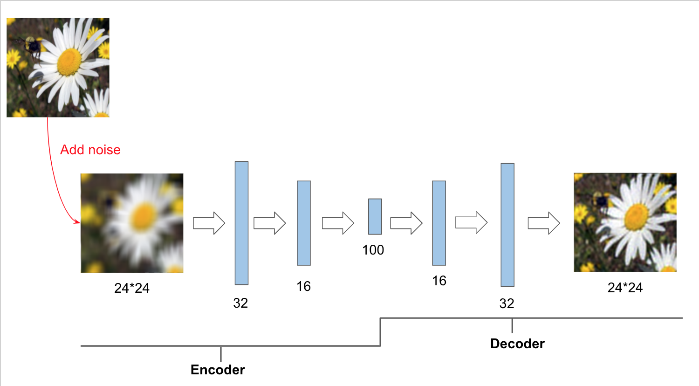
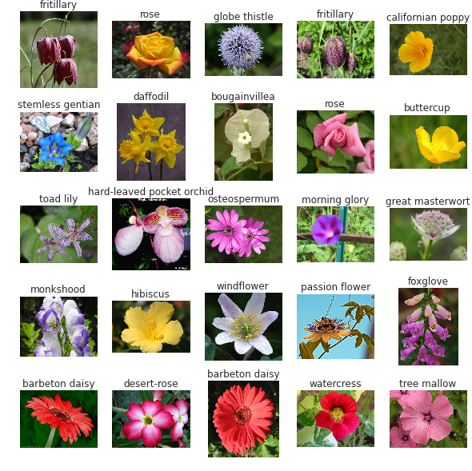
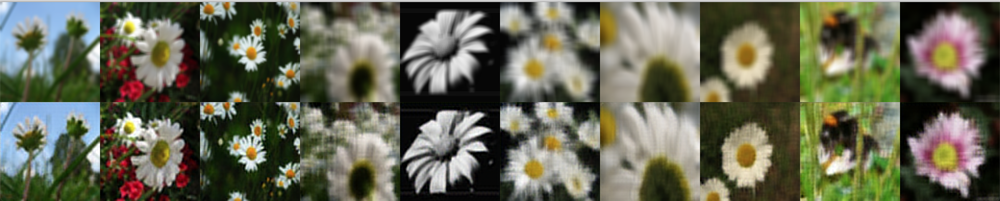

## Super Resolution Implementation
This repository is about Super Resolution in Tensorflow 2 ,
 super resolution is the process of upscaling and or improving the details within an image.  
  Often a low resolution image is taken as an input and the same image is upscaled to a higher resolution, which is the output.   
  The details in the high resolution output are filled in where the details are essentially unknown.


#### The Architecrure of Super Resolution     
<p></p>  
<center>

</center>   

### Training on Flowers  

<p></p>     
<center>


</center>

### Requirement
```
python==3.7.0
numpy==1.18.1
```
### How to use
Training & Prediction can be run as follows:    
`python train.py train`  
`python train.py predict img.png`  


### More information
* Please refer to the original paper of Super Resolution [here](https://openaccess.thecvf.com/content_ECCV_2018/papers/Seong-Jin_Park_SRFeat_Single_Image_ECCV_2018_paper.pdf) for more information.

### Implementation Notes
* **Note 1**:   
Since datasets are somehow huge and painfully slow in training ,I decided to make number of units variable. If you want to run it in your PC, you can reduce or increase the number of units into any number you like. (128 is by default). For example:  
`model = conv_ae.Conv_AE((None,height, width, channel), latent = 200, units=64)`

* **Note 2** :   
You can also make the size of images smaller, so that it can be ran faster and doesn't take too much memories.
(If the image size is too small ,it may effect the training result.)


### Result for Flowers:
* width = 48 << 2
* height= 48 << 2  
* Learning rate = 0.0001
* Batch size = 8  
* Optimizer = Adam   
* units = 128
* latent = 200

<center>

</center>   
